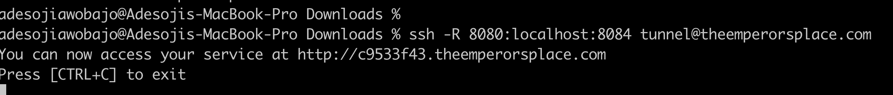
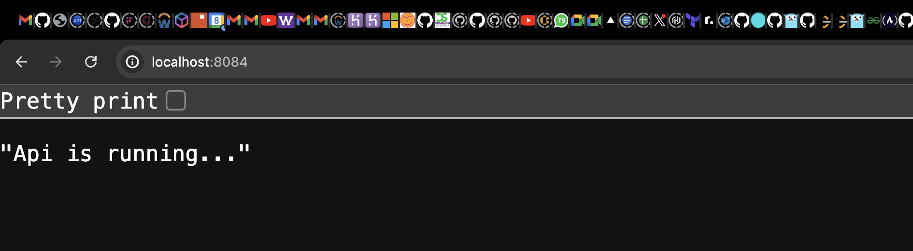
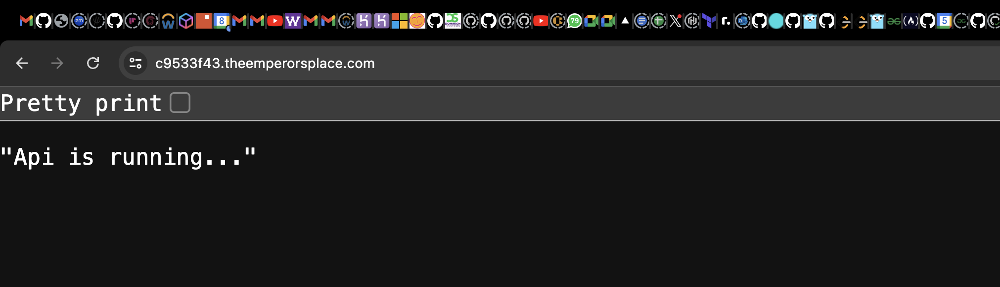

# Building a Secure Tunneling Service with SSH Reverse Forwarding

# Overview

This script is designed to set up a reverse tunneling service on a server using SSH and Nginx. It automates the process of configuring the necessary components, obtaining an SSL certificate, and creating scripts for easy management of the tunneling service.

## Features

- **Root Privileges Check:** The script checks if it's being run as root. If not, it re-executes itself with `sudo` to ensure the necessary permissions.

- **Package Installation:**
  - Ensures Python 3 and Nginx are installed on the system. If not, they are installed and Nginx is enabled to start on boot.

- **Tunnel User Setup:**
  - Creates a system user called `tunnel` with a disabled password.
  - Configures SSH settings to allow passwordless login and restricts other authentication methods for the `tunnel` user.

- **SSH Configuration:**
  - Modifies the SSH daemon configuration (`/etc/ssh/sshd_config`) to:
    - Disable root login and empty passwords.
    - Enable public key authentication.
    - Disable PAM (Pluggable Authentication Modules).
    - Allow passwordless login for the `tunnel` user.
  - Adds a specific configuration block for the `tunnel` user to permit SSH tunneling and specify the execution of the tunnel script upon login.
  - Restarts the SSH service to apply the new settings.

- **Tunnel Script Creation:**
  - A script called `tunnel_script.sh` is created and stored at `/usr/local/bin/tunnel_script.sh`.
  - This script generates a random subdomain, configures Nginx to proxy traffic from this subdomain to a local service running on port 8080, and reloads Nginx to apply the configuration.
  - Keeps the SSH session alive to maintain the tunnel.

- **Access Details:**
  - The script provides the SSH command needed to establish the tunnel: `ssh -R 8080:localhost:3000 tunnel@theemperorsplace.com`.

## Usage

1. Clone the repository or download the script to your server.

2. Make the script executable:

   ```bash
   chmod +x tunnel.sh
   ```
3. Run the script
   ```
   ./tunnel.sh
   ```
4.Once the script completes, you can create a tunnel using the provided SSH command. Replace `localhost:3000` with the address and port of the local service you want to expose.


# How to test
1. Make sure you have something running on your local port, for example an app running on a PORT 8084 i.e `localhost:8084`.

2. Open a new terminal on your machine and run the command 
```
ssh -R 8080:localhost:8084 tunnel@theemperorsplace.com
``` 

3. A subdomain is generated which forwards what your have on your `localhost:8084` to the generated subdomain url

- See below:

### My terminal


### What is currently running on my `localhost:8084`


### What is forwarded to the subdomain generated:  `https://c9533f43.theemperorsplace.com/`



# Additional Information
- Ensure that your domain `domain.com` is correctly configured to point to your server.
- The script assumes the local service you want to expose is running on port 3000. Modify the SSH command as needed.

## Troubleshooting
- If the Nginx configuration test fails, the script will remove the faulty configuration file and notify you to try again.
- Verify that the SSH and Nginx services are running without issues after the script execution

